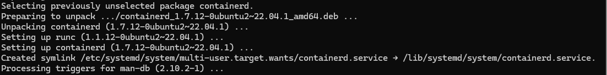
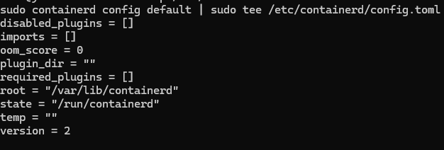
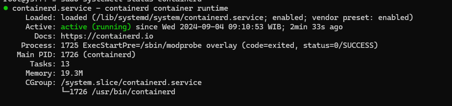
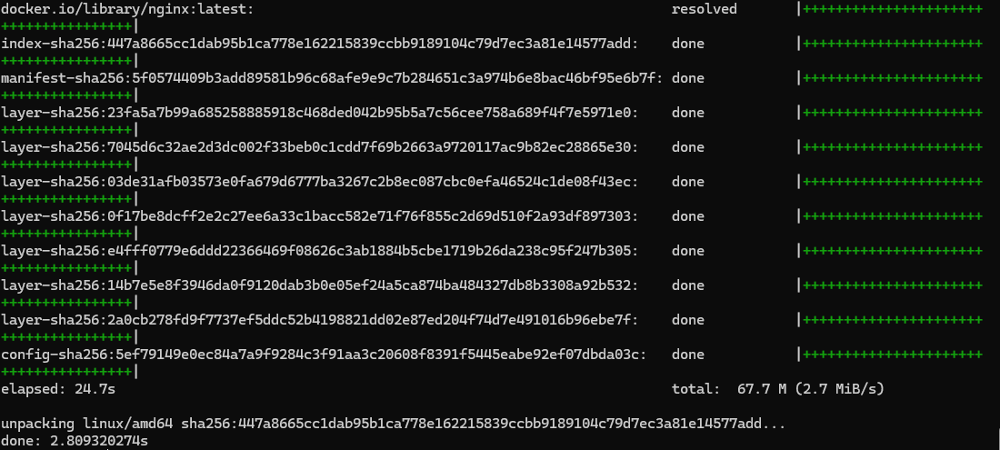

# Praktikum Teknologi Cloud: Containerd

## Persyaratan

- **Docker Desktop**.
- **WSL (Windows Subsystem for Linux)**: WSL digunakan untuk menjalankan perintah Linux di Windows.

## Langkah-langkah Instalasi

### 1. Mengaktifkan Integrasi Containerd di Docker Desktop

1. Buka Docker Desktop dan masuk ke pengaturan dengan mengklik ikon roda gigi di pojok kanan atas.
2. Di tab **General**, centang opsi **Enable integration with Containerd**.

### 2. Menginstal Containerd di WSL

1. **Buka Terminal WSL**:
   - Jalankan distribusi Linux yang sudah diinstal (contoh: Ubuntu).

2. **Update dan Instal Containerd**:
   ```bash
   sudo apt-get update
   sudo apt-get install -y containerd
   ```
   

3. **Konfigurasi Containerd**:
   buat file konfigurasi default untuk Containerd
   ```bash
   sudo mkdir -p /etc/containerd
   sudo containerd config default | sudo tee /etc/containerd/config.toml
   ```
   

4. **Mulai dan Verifikasi Containerd**:
   Jalankan Containerd:
   ```bash
   sudo systemctl start containerd
   ```
   Verifikasi bahwa Containerd berjalan dengan benar
   ```bash
   sudo systemctl status containerd
   ```
   

### 3. Menjalankan Container Menggunakan Containerd
1. **Menarik Image dari Docker Hub**:
   Gunakan CLI `ctr` untuk menarik image:
   ```bash
   sudo ctr image pull docker.io/library/nginx:latest
   ```

2. **Menjalankan Container**:
   Jalankan container dengan image Nginx:
   ```bash
   sudo ctr run --rm -t docker.io/library/nginx:latest nginx-test
   ```
   Perintah ini akan menjalankan container Nginx dan menghapusnya setelah selesai (`--rm`).
   

